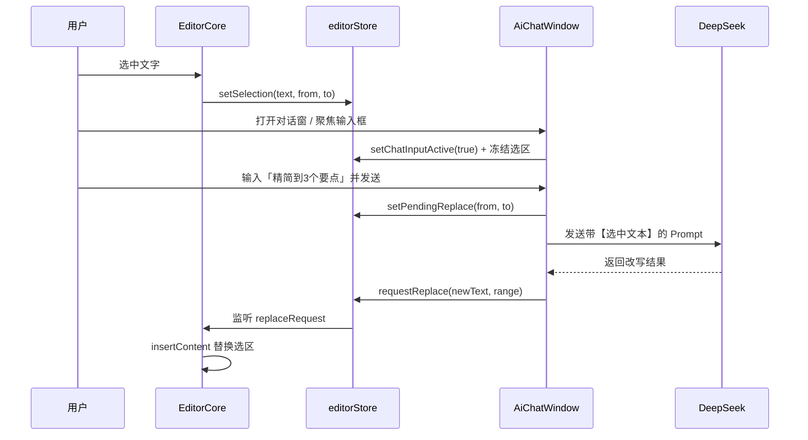

# AI 写作助手 V1 需求文档

**版本**：V1.2（已实现 + 持续迭代）  
**状态**：已实现（MVP）· **当前为完全免费模式** · **核心功能已全部实现**  
**所属产品**：WPX AI 智能文档编辑器（桌面端）  
**最后更新**：2026-06-28

---

## 〇、业务模式变更说明（V1.0 → V1.1）

> **重要变更**：自 V1.1 起，WPX 桌面端整体调整为 **完全免费模式**：
> 
> 1. **平台不再内置任何大模型 API 接入**：取消 V1.0 中默认提供的 DeepSeek 公共 API 与 `VITE_DEEPSEEK_API_KEY` 注入方式。所有 AI 能力（选区改写、自由对话、Skills 等）所需的 LLM，必须由用户在本机自行配置并接入。
> 2. **平台不再提供商业字体库与 Token 充值服务**：取消「字体商店」「Token 充值」相关入口与功能。商业字体需求由用户自行采购合法授权并通过「导入本地字体」功能使用。
> 3. **工具本体永久免费**：编辑器、多窗口、PDF/DOCX/Markdown 互转、压缩解压、内置 8 款免费开源字体、自导入字体、内置 Skills、资料库 RAG 等全部功能永久免费使用，不再收取任何费用。
> 4. **唯一前置条件**：用户需自行准备大模型 API（推荐国产大模型：DeepSeek、智谱 GLM、通义千问 Qwen、文心一言、字节豆包、Kimi、腾讯混元等），并在桌面客户端「我的模型」中完成本地配置。
> 
> 本文档下述章节已按上述变更同步更新。

---

## 一、文档说明

本文档从 [WPX 产品需求文档 (PRD)](./WPX-AI智能文档编辑器%20-%20产品需求文档%20(PRD).md) 中提炼 **AI 助手模块** 的 V1 范围，作为开发、验收与迭代的依据。

**V1 定位**：本地桌面端的浮动 AI 写作助手，支持自然语言对话，并完成「选中文本 → AI 改写 → 自动回填」的核心编辑闭环。**所有大模型调用均通过用户在本地配置的 API 完成，平台不提供任何内置模型服务**。

---

## 二、产品目标

| 目标 | 说明 |
|------|------|
| 低门槛入口 | 固定右下角头像，一键唤起，不打断写作心流 |
| 对话式交互 | 用户用自然语言描述意图，无需学习复杂菜单 |
| 选区驱动编辑 | 选中编辑器内容后，通过指令完成局部改写并自动替换 |
| 可移动窗口 | 对话窗可拖拽、缩放、钉住，适配不同屏幕与习惯 |

**V1 不做**：资料库 RAG、@ 引用、表格/图片专项对话、全文结构化生成、用户记忆与模板、服务端代理鉴权。

> **V1.2 补充说明**：自 V1 发布以来，以下原计划「V1 不做」或「V1.2+」的功能已提前实现：
> - [x] CopilotKit Runtime 集成（Agent 编排 + A2UI）
> - [x] jcode 高性能 AI 引擎集成（检测/启动/状态指示/IPC 通道）
> - [x] 多模型切换（对话窗顶部下拉，支持 12+ 国产大模型预设）
> - [x] 本地指令系统（LocalCommandMessage，MD 排版等纯前端指令）
> - [x] Skills 系统（通用 15+ + 大学生/教师专用 Skills）
> - [x] 流式打字机效果
> - [x] 对话历史页面内保持
> - [x] 自定义头像持久化

---

## 三、用户角色与典型场景

**目标用户**：在 WPX 中进行文档创作的个人用户（博主、产品经理、知识工作者等）。

### 场景 1：选中文本改写（P0 · V1 核心）

1. 用户在 Tiptap 编辑器中选中一段文字  
2. 点击右下角 AI 头像，打开对话窗  
3. 点击输入框（自动附加选中文本为上下文）  
4. 输入指令，如：「精简到 3 个要点」  
5. AI 返回改写结果，**自动替换**原选区内容  

### 场景 2：自由对话（P0 · V1 基础）

1. 打开 AI 对话窗  
2. 不选中任何文本，直接提问或闲聊  
3. 助手在对话区返回文本回复（不修改文档）  

### 场景 3：窗口布局调整（P0）

1. 拖动标题栏移动对话窗位置  
2. 拖拽边缘调整大小（不小于 300×300）  
3. 点击 📌 钉住窗口，防止误拖  
4. 点击 ✕ 关闭对话窗（头像仍保留）  

---

## 四、功能需求

### 4.1 助手入口 · AiAvatar

| 编号 | 需求 | 验收标准 |
|------|------|----------|
| A-01 | 固定右下角展示 | `position: fixed`，`bottom: 20px`，`right: 20px` |
| A-02 | 圆形头像，直径 56px | 支持 `avatarUrl` prop 自定义图片；无 URL 时显示默认图标 |
| A-03 | 点击切换对话窗 | 触发 `toggle` 事件，打开/关闭 AiChatWindow |
| A-04 | Hover 反馈 | 放大 1.1 倍，过渡 0.2s |
| A-05 | 层级 | `z-index: 1000`，始终浮于主内容之上 |

### 4.2 浮动对话窗 · AiChatWindow

| 编号 | 需求 | 验收标准 |
|------|------|----------|
| W-01 | 基于 vue3-draggable-resizable | 可拖拽、可缩放 |
| W-02 | 默认尺寸与约束 | 默认 400×500；最小 300×300 |
| W-03 | 初始位置 | 右下角，位于头像上方，不遮挡头像 |
| W-04 | 标题栏 | 显示「AI 写作助手」 |
| W-05 | 钉住 | 📌 按钮切换钉住状态，`emit('pin-change', isPinned)`；钉住后不可拖拽 |
| W-06 | 关闭 | ✕ 按钮关闭窗口 |
| W-07 | 消息列表 | 上部展示 `messages`（user / assistant 气泡） |
| W-08 | 输入区 | 下部 textarea；Enter 发送，Shift+Enter 换行 |
| W-09 | 可见性 | `visible=false` 时不渲染 |
| W-10 | 层级 | `z-index: 1001`（高于头像） |
| W-11 | 选区预览 | 输入框激活且有选中文本时，展示「选中文本将附加到消息」预览区 |

### 4.3 选区感知与自动替换 · EditorCore + editorStore

| 编号 | 需求 | 验收标准 |
|------|------|----------|
| E-01 | 选区检测 | 编辑器 `onSelectionUpdate` 同步 `{ text, from, to, hasSelection }` |
| E-02 | 选区提示 | 有选区时，编辑器底部显示已选字数与操作引导 |
| E-03 | 输入框激活冻结选区 | AI 输入框 focus 时冻结当前选区，避免失焦丢失 |
| E-04 | 上下文附加 | 发送消息时，若输入框处于激活且有选区，自动将选中文本拼入 Prompt |
| E-05 | 自动替换 | AI 响应完成后，用 Tiptap 命令将返回文本替换原 `{ from, to }` 范围 |
| E-06 | 多行支持 | 返回文本含换行时，按段落插入编辑器 |

### 4.4 AI 对话能力 · useAiChat

| 编号 | 需求 | 验收标准 |
|------|------|----------|
| C-01 | SDK 集成 | 基于 `@ai-sdk/vue` Chat + `DirectChatTransport`，兼容 OpenAI Chat Completions 协议 |
| C-02 | 模型来源 | **仅限用户本地配置**的第三方大模型 API；平台不提供任何默认模型 Endpoint / Key |
| C-03 | API Key 来源 | 由用户在「我的模型」页面手动输入，本地 AES 加密存储；**不**从环境变量 `VITE_DEEPSEEK_API_KEY` 注入，**不**提供任何平台密钥 |
| C-04 | System Prompt | 支持通过参数传入；V1 默认强调「选区改写时只输出正文」 |
| C-05 | 对外接口 | 返回 `messages`、`input`、`handleSubmit`、`isLoading` |
| C-06 | 流式响应 | 支持 streaming 状态（`submitted` / `streaming` / `ready`） |
| C-07 | 未配置提示 | 用户首次打开对话窗但「我的模型」未配置任何 API Key 时，显示引导卡片与「去配置」按钮，引导前往「我的模型」完成配置 |
| C-08 | 多模型支持 | 用户可同时保存多个模型配置（如 DeepSeek、智谱 GLM、通义千问、文心一言等），在对话窗顶部下拉切换 |
| C-09 | 配置校验 | 发送消息前检查 API Key 是否存在；不存在则拦截请求并提示配置 |

> **适配大模型清单（用户自行接入）**：DeepSeek、智谱 GLM（ChatGLM）、阿里通义千问（Qwen）、百度文心一言、字节豆包、月之暗面 Kimi、腾讯混元、SiliconFlow、OpenAI、Anthropic Claude、本地 Ollama / LM Studio 等任意 OpenAI 兼容接口。详细接入教程见附录 A。

---

## 五、交互流程

### 5.1 选中文本改写（主流程）



### 5.2 Prompt 结构（选区模式）

```
用户指令：{用户输入}

【选中文本】
{编辑器选中的纯文本}

请直接输出修改后的文本，不要添加解释。
```

System Prompt 要求模型：**仅输出修改后正文**，不使用 markdown 代码块包裹。

---

## 六、技术架构

### 6.1 模块划分

| 模块 | 路径 | 职责 |
|------|------|------|
| AiAvatar | `src/components/ai/AiAvatar.vue` | 固定入口；点击后若未配置任何模型则弹出引导 |
| AiChatWindow | `src/components/ai/AiChatWindow.vue` | 可拖拽对话 UI；标题栏显示当前模型选择下拉；未配置时显示引导卡片 |
| AiAssistantPlaceholder | `src/components/layout/AiAssistantPlaceholder.vue` | 组装入口 + 对话窗，编排业务流 |
| useAiChat | `src/composables/useAiChat.js` | **读取本地用户配置**的 LLM Endpoint / Key / 模型名，调用 OpenAI 兼容接口 |
| editorStore | `src/stores/editor.js` | 选区、冻结、替换指令 |
| aiSelection | `src/utils/aiSelection.js` | Prompt 构建、结果提取、内容转换 |
| appStore | `src/stores/app.js` | 对话窗开关状态 |
| 模型配置页面 | `src/views/settings/ModelsView.vue` | 用户配置 / 切换 / 测试第三方大模型 API；API Key 本地 AES 加密 |

### 6.2 状态说明（editorStore）

| 状态 | 含义 |
|------|------|
| `selection` | 编辑器当前实时选区 |
| `frozenSelection` | 输入框 focus 时快照，防止选区丢失 |
| `chatInputActive` | AI 输入框是否激活 |
| `pendingReplace` | 待替换的文档范围 `{ from, to }` |
| `replaceRequest` | 发给编辑器的替换指令 `{ text, from, to }` |

### 6.3 模型与 API Key 配置

**V1.1 起不再提供任何平台端配置**。V1.0 时期的环境变量方式已废弃：

```bash
# V1.0 废弃：环境变量不再生效
# VITE_DEEPSEEK_API_KEY=sk-xxxxxxxx  # 已忽略
```

**V1.1 配置方式**：在桌面客户端「设置 → 我的模型」中手动添加模型：

| 字段 | 说明 | 示例 |
|------|------|------|
| **服务商** | 下拉选择：DeepSeek / 智谱 GLM / 通义千问 / 文心一言 / 豆包 / Kimi / 混元 / OpenAI / Anthropic / Ollama / 自定义 | DeepSeek |
| **API Endpoint** | OpenAI 兼容协议的 baseURL | `https://api.deepseek.com/v1` |
| **API Key** | 服务商颁发的密钥，本地 AES 加密 | `sk-xxxxxxxx` |
| **模型名称** | 该服务商下的具体模型 | `deepseek-chat`、`glm-4-flash`、`qwen-plus` 等 |
| **测试连接** | 发送 `GET /models` 验证配置 | 成功 ✓ / 失败 ✕ |

> **安全说明**：API Key 始终加密存储在本地 Electron `userData` 目录，**不上传任何服务器**，仅在发起推理请求时由渲染进程通过 Electron IPC 临时解密后使用。各服务商详细接入步骤见附录 A。

---

## 6.4 表格与导出模块的产品调整

**字体库业务调整**（V1.1）：

- **取消**「商业字体商店」与「Token 充值」入口。
- **取消** `font-market`、`token-recharge`、`token-consume`、`token-balance` 等后端接口。
- 商业字体需求由用户自行采购合法授权后，通过「设置 → 字体管理 → 导入本地字体」功能加载。
- 内置 8 款免费开源字体保持不变；用户自导入字体**不**消耗任何 WPX 平台 Token。

> 完整调整说明见 [WPX 字体库需求文档](./WPX%20字体库需求文档.md)。

---

## 七、UI 规范摘要

| 元素 | 规范 |
|------|------|
| 头像 | 56px 圆形，品牌紫 `#7c3aed`，阴影 `0 4px 12px rgba(15,23,42,0.15)` |
| 对话窗 | 圆角 16px，阴影 `0 12px 40px rgba(15,23,42,0.18)` |
| 用户气泡 | 右对齐，紫色背景 `#7c3aed` |
| 助手气泡 | 左对齐，灰底 `#f1f5f9` |
| 选区预览 | 输入框上方，浅紫底 `#f5f3ff`，最多展示 2 行 |
| 选区提示条 | 编辑器底部，浅紫底，显示已选字数 |

---

## 八、验收标准（V1 Checklist — 全部通过 ✅）

- [x] 右下角头像固定显示，点击可开关对话窗  
- [x] 对话窗可拖拽、缩放，默认 400×500，最小 300×300  
- [x] 📌 钉住后窗口不可拖动；✕ 可关闭  
- [x] Enter 发送消息，Shift+Enter 换行  
- [x] **用户在「我的模型」中配置任意大模型 API 后，可与该模型正常对话**（V1.1 不提供任何平台模型）
- [x] 未配置任何模型时，打开对话窗显示引导卡片与「去配置」按钮
- [x] 对话窗顶部可下拉切换已配置的多个模型
- [x] 编辑器选中文本后，底部出现选区提示  
- [x] 输入框激活时显示选中文本预览  
- [x] 发送选区改写指令后，AI 返回内容自动替换原选区  
- [x] 无选区时对话不修改文档内容  
- [x] 对话窗不遮挡右下角头像  
- [x] API Key 仅本地 AES 加密存储，不出现在日志、调试面板、导出文件等任何明文位置  

---

## 九、V1 范围外（后续版本）

| 能力 | 计划版本 | 说明 |
|------|----------|------|
| 生成结构化初稿 | V1.2+ | 「写一份 Q3 运营计划」→ 整篇 MD 插入编辑器 |
| 全文改写 | V1.2+ | 无选区时对全文润色/翻译 |
| 表格对话 | V2 | 选中表格区域后增删列、对齐等 |
| 图片对话 | V2 | 去背景、标注等，联动图片模块 |
| 资料库 @ 引用 | V2 | RAG 检索写作 |
| 自定义头像持久化 | V1.2 | 用户上传头像并保存 |
| 对话历史持久化 | V1.2 | 刷新页面后保留会话 |
| 流式打字机效果 | V1.2 | 消息区逐字展示 |
| ~~服务端 API 代理~~ | **已废弃** | **V1.1 不再提供任何服务端模型代理或公共配额**；仅由用户本地配置 |
| 错误重试 / 取消生成 | V1.2 | 加载态操作完善 |
| 模型调用使用量统计 | **已废弃** | 仅在用户本地展示当前 Provider 用量，不再有平台配额 |

---

## 十、风险与约束

1. **选区偏移**：用户在 AI 响应期间编辑文档，可能导致 `from/to` 失效；V1 不处理冲突，后续考虑 Document Version 校验。
2. **格式丢失**：V1 替换以纯文本为主，不保留原选区内的加粗、链接等行内格式。
3. **模型输出稳定性**：依赖 System Prompt 约束；若模型返回解释性文字，需 `extractReplacementText` 做兜底清洗。
4. **本地 Key 安全**：API Key 存储在 Electron `userData` 中的加密文件，须确保主进程加密实现使用平台原生 API（如 `safeStorage`），不依赖自实现 AES。
5. **跨域 / 代理**：调用用户配置的第三方 Endpoint 时由渲染进程直连；若服务商需代理转发，由用户自建反向代理，平台不提供。
6. **服务商变更风险**：用户配置的模型服务可能停服、下线或调整计费，平台不承担服务可用性责任，请在「我的模型」中及时切换。
7. **模型选型责任**：不同模型的指令遵循能力差异较大，个别小模型可能无法满足「选区改写仅返回正文」的约束，需用户自行选型。

---

## 十一、相关文档

- [WPX 产品需求文档 (PRD)](./WPX-AI智能文档编辑器%20-%20产品需求文档%20(PRD).md) — 完整产品规划
- 代码目录：`wpx-app/src/components/ai/`、`wpx-app/src/composables/useAiChat.js`

---

## 附录 A：国产大模型接入教程

> 自 V1.1 起，WPX 不再内置任何平台大模型服务；请按本附录的步骤，在桌面客户端中接入你选择的国产大模型服务商。

### A.1 通用步骤

1. 打开桌面客户端，点击右上角齿轮进入「设置」。
2. 选择「**我的模型**」标签页。
3. 点击「**+ 添加模型**」，选择服务商或选择「自定义 OpenAI 兼容」。
4. 按下方表格填写 **API Endpoint**、**API Key**、**模型名称**。
5. 点击「**测试连接**」，看到绿色 ✓ 后保存。
6. 回到 AI 对话窗顶部下拉，选择刚才添加的模型即可使用。

### A.2 国产大模型服务商

| 服务商 | 推荐模型（适用场景） | 官方接入文档 | 备注 |
|--------|----------------------|--------------|------|
| **DeepSeek**（深度求索） | `deepseek-chat`（通用对话）、`deepseek-reasoner`（推理） | https://platform.deepseek.com/api-docs/zh-cn/ | 价格低、中文能力强，注册送额度 |
| **智谱 AI（GLM）** | `glm-4-flash`（免费快）、`glm-4-plus`（高质量） | https://bigmodel.cn/dev/api/normal-model/glm-4 | 新用户赠送 2000 万 Tokens |
| **阿里云通义千问（Qwen）** | `qwen-turbo`、`qwen-plus`、`qwen-max` | https://help.aliyun.com/zh/model-studio/developer-reference/use-qwen-by-calling-api | 阿里云百炼平台，按 Token 计费 |
| **百度文心一言（ERNIE）** | `ernie-4.5-8k`、`ernie-speed`（免费） | https://cloud.baidu.com/doc/WENXINWORKSHOP/s/hlrk4akp7 | 千帆平台，需企业认证领取免费额度 |
| **字节豆包（Doubao）** | `doubao-lite-32k`、`doubao-pro-32k` | https://www.volcengine.com/docs/82379/1099455 | 火山引擎，1 元体验额度 |
| **月之暗面 Kimi** | `moonshot-v1-8k`、`moonshot-v1-128k` | https://platform.moonshot.cn/docs/api-reference | 长上下文能力强 |
| **腾讯混元（Hunyuan）** | `hunyuan-standard`、`hunyuan-pro` | https://cloud.tencent.com/document/product/1729 | 腾讯云，需开通混元大模型 |
| **SiliconFlow（硅基流动）** | `Qwen/Qwen2.5-7B-Instruct` 等开源模型托管 | https://docs.siliconflow.cn/cn/api-reference/chat-completions/chat-completions | 整合多款开源模型，注册送额度 |

### A.3 填写要点

- **API Endpoint**：一般填服务商文档中的 `base_url` + `/v1`，例如 `https://api.deepseek.com/v1`、`https://open.bigmodel.cn/api/paas/v4/`（智谱是 `/v4` 不是 `/v1`，需注意）。
- **API Key**：在服务商控制台「API Keys」页面创建并复制；**切勿泄露**。WPX 存储在本地加密文件中，不会发送到任何平台服务器。
- **模型名称**：复制服务商文档中标注为「可用于 Chat Completions 接口」的模型 ID；如 `deepseek-chat`、`glm-4-flash`。

### A.4 本地 / 私有部署

如果你本地运行 Ollama、LM Studio、vLLM、FastChat 等兼容 OpenAI 协议的本地推理服务：

| 服务 | Endpoint | 说明 |
|------|----------|------|
| **Ollama** | `http://localhost:11434/v1` | `API Key` 任意非空字符串（如 `ollama`） |
| **LM Studio** | `http://localhost:1234/v1` | 启动本地 server 后填入 |
| **vLLM / FastChat** | 按启动参数中的 `--host --port` 填入 | 需自行保证 CORS / 网络可达 |

### A.5 常见问题

- **Q：测试连接一直转圈？**  
  A：检查 API Key 是否正确、Endpoint 是否含 `/v1`、服务商账号是否欠费；如使用本地 Ollama，请确认本地服务已启动并允许远程连接。
- **Q：发送消息后报错 401？**  
  A：API Key 无效或被吊销，请到服务商控制台重新生成。
- **Q：报错 429 / "余额不足"？**  
  A：服务商账户欠费或免费额度用完，请到对应控制台充值或切换其他服务商。
- **Q：选区改写后格式丢失？**  
  A：当前模型未严格遵循 System Prompt；建议切换为 `deepseek-chat`、`glm-4-plus`、`qwen-plus` 等指令遵循能力较强的模型。
- **Q：能接入 ChatGPT / Claude 吗？**  
  A：OpenAI 兼容接口可直接接入；Anthropic Claude 需使用「自定义」并配置 Anthropic Messages API 适配（部分功能需平台后续支持）。
