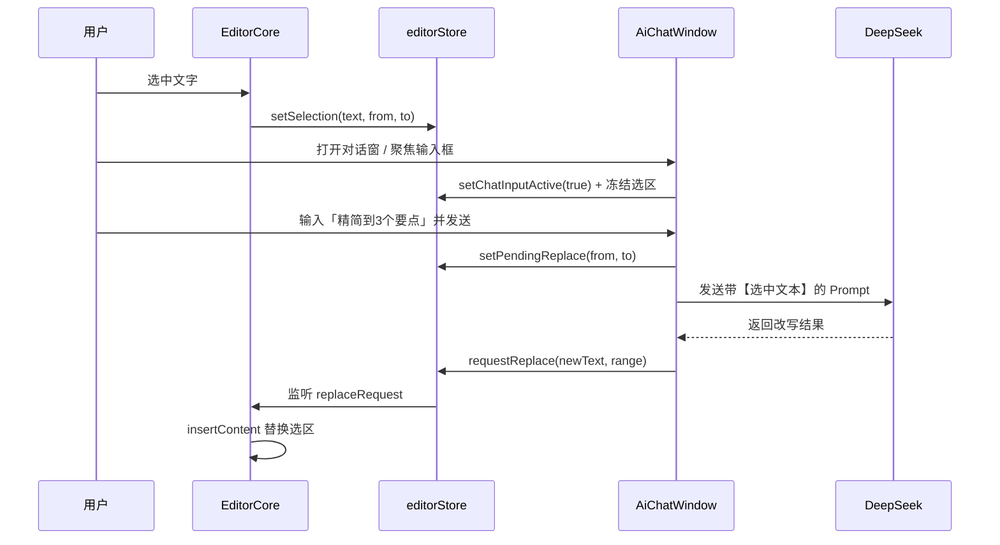

# AI 写作助手 V1 需求文档

**版本**：V1.0  
**状态**：已实现（MVP）  
**所属产品**：WPX AI 智能文档编辑器  
**最后更新**：2026-06-22

---

## 一、文档说明

本文档从 [WPX 产品需求文档 (PRD)](./WPX-AI智能文档编辑器%20-%20产品需求文档%20(PRD).md) 中提炼 **AI 助手模块** 的 V1 范围，作为开发、验收与迭代的依据。

**V1 定位**：非侵入式浮动助手，支持自然语言对话，并完成「选中文本 → AI 改写 → 自动回填」的核心编辑闭环。

---

## 二、产品目标

| 目标 | 说明 |
|------|------|
| 低门槛入口 | 固定右下角头像，一键唤起，不打断写作心流 |
| 对话式交互 | 用户用自然语言描述意图，无需学习复杂菜单 |
| 选区驱动编辑 | 选中编辑器内容后，通过指令完成局部改写并自动替换 |
| 可移动窗口 | 对话窗可拖拽、缩放、钉住，适配不同屏幕与习惯 |

**V1 不做**：资料库 RAG、@ 引用、表格/图片专项对话、全文结构化生成、用户记忆与模板、服务端代理鉴权。

---

## 三、用户角色与典型场景

**目标用户**：在 WPX 中进行文档创作的个人用户（博主、产品经理、知识工作者等）。

### 场景 1：选中文本改写（P0 · V1 核心）

1. 用户在 Tiptap 编辑器中选中一段文字  
2. 点击右下角 AI 头像，打开对话窗  
3. 点击输入框（自动附加选中文本为上下文）  
4. 输入指令，如：「精简到 3 个要点」  
5. AI 返回改写结果，**自动替换**原选区内容  

### 场景 2：自由对话（P0 · V1 基础）

1. 打开 AI 对话窗  
2. 不选中任何文本，直接提问或闲聊  
3. 助手在对话区返回文本回复（不修改文档）  

### 场景 3：窗口布局调整（P0）

1. 拖动标题栏移动对话窗位置  
2. 拖拽边缘调整大小（不小于 300×300）  
3. 点击 📌 钉住窗口，防止误拖  
4. 点击 ✕ 关闭对话窗（头像仍保留）  

---

## 四、功能需求

### 4.1 助手入口 · AiAvatar

| 编号 | 需求 | 验收标准 |
|------|------|----------|
| A-01 | 固定右下角展示 | `position: fixed`，`bottom: 20px`，`right: 20px` |
| A-02 | 圆形头像，直径 56px | 支持 `avatarUrl` prop 自定义图片；无 URL 时显示默认图标 |
| A-03 | 点击切换对话窗 | 触发 `toggle` 事件，打开/关闭 AiChatWindow |
| A-04 | Hover 反馈 | 放大 1.1 倍，过渡 0.2s |
| A-05 | 层级 | `z-index: 1000`，始终浮于主内容之上 |

### 4.2 浮动对话窗 · AiChatWindow

| 编号 | 需求 | 验收标准 |
|------|------|----------|
| W-01 | 基于 vue3-draggable-resizable | 可拖拽、可缩放 |
| W-02 | 默认尺寸与约束 | 默认 400×500；最小 300×300 |
| W-03 | 初始位置 | 右下角，位于头像上方，不遮挡头像 |
| W-04 | 标题栏 | 显示「AI 写作助手」 |
| W-05 | 钉住 | 📌 按钮切换钉住状态，`emit('pin-change', isPinned)`；钉住后不可拖拽 |
| W-06 | 关闭 | ✕ 按钮关闭窗口 |
| W-07 | 消息列表 | 上部展示 `messages`（user / assistant 气泡） |
| W-08 | 输入区 | 下部 textarea；Enter 发送，Shift+Enter 换行 |
| W-09 | 可见性 | `visible=false` 时不渲染 |
| W-10 | 层级 | `z-index: 1001`（高于头像） |
| W-11 | 选区预览 | 输入框激活且有选中文本时，展示「选中文本将附加到消息」预览区 |

### 4.3 选区感知与自动替换 · EditorCore + editorStore

| 编号 | 需求 | 验收标准 |
|------|------|----------|
| E-01 | 选区检测 | 编辑器 `onSelectionUpdate` 同步 `{ text, from, to, hasSelection }` |
| E-02 | 选区提示 | 有选区时，编辑器底部显示已选字数与操作引导 |
| E-03 | 输入框激活冻结选区 | AI 输入框 focus 时冻结当前选区，避免失焦丢失 |
| E-04 | 上下文附加 | 发送消息时，若输入框处于激活且有选区，自动将选中文本拼入 Prompt |
| E-05 | 自动替换 | AI 响应完成后，用 Tiptap 命令将返回文本替换原 `{ from, to }` 范围 |
| E-06 | 多行支持 | 返回文本含换行时，按段落插入编辑器 |

### 4.4 AI 对话能力 · useAiChat

| 编号 | 需求 | 验收标准 |
|------|------|----------|
| C-01 | SDK 集成 | 基于 `@ai-sdk/vue` Chat + `DirectChatTransport` |
| C-02 | 模型配置 | DeepSeek API，`baseURL: https://api.deepseek.com`，模型 `deepseek-chat` |
| C-03 | API Key | 从环境变量 `VITE_DEEPSEEK_API_KEY` 读取 |
| C-04 | System Prompt | 支持通过参数传入；V1 默认强调「选区改写时只输出正文」 |
| C-05 | 对外接口 | 返回 `messages`、`input`、`handleSubmit`、`isLoading` |
| C-06 | 流式响应 | 支持 streaming 状态（`submitted` / `streaming` / `ready`） |

---

## 五、交互流程

### 5.1 选中文本改写（主流程）



### 5.2 Prompt 结构（选区模式）

```
用户指令：{用户输入}

【选中文本】
{编辑器选中的纯文本}

请直接输出修改后的文本，不要添加解释。
```

System Prompt 要求模型：**仅输出修改后正文**，不使用 markdown 代码块包裹。

---

## 六、技术架构

### 6.1 模块划分

| 模块 | 路径 | 职责 |
|------|------|------|
| AiAvatar | `src/components/ai/AiAvatar.vue` | 固定入口 |
| AiChatWindow | `src/components/ai/AiChatWindow.vue` | 可拖拽对话 UI |
| AiAssistantPlaceholder | `src/components/layout/AiAssistantPlaceholder.vue` | 组装入口 + 对话窗，编排业务流 |
| useAiChat | `src/composables/useAiChat.js` | DeepSeek 对话封装 |
| editorStore | `src/stores/editor.js` | 选区、冻结、替换指令 |
| aiSelection | `src/utils/aiSelection.js` | Prompt 构建、结果提取、内容转换 |
| appStore | `src/stores/app.js` | 对话窗开关状态 |

### 6.2 状态说明（editorStore）

| 状态 | 含义 |
|------|------|
| `selection` | 编辑器当前实时选区 |
| `frozenSelection` | 输入框 focus 时快照，防止选区丢失 |
| `chatInputActive` | AI 输入框是否激活 |
| `pendingReplace` | 待替换的文档范围 `{ from, to }` |
| `replaceRequest` | 发给编辑器的替换指令 `{ text, from, to }` |

### 6.3 环境配置

```bash
# .env
VITE_DEEPSEEK_API_KEY=sk-xxxxxxxx
```

> **安全说明（V1 限制）**：API Key 当前通过 Vite 环境变量注入前端，仅适用于本地开发或内测。生产环境应迁移至服务端代理。

---

## 七、UI 规范摘要

| 元素 | 规范 |
|------|------|
| 头像 | 56px 圆形，品牌紫 `#7c3aed`，阴影 `0 4px 12px rgba(15,23,42,0.15)` |
| 对话窗 | 圆角 16px，阴影 `0 12px 40px rgba(15,23,42,0.18)` |
| 用户气泡 | 右对齐，紫色背景 `#7c3aed` |
| 助手气泡 | 左对齐，灰底 `#f1f5f9` |
| 选区预览 | 输入框上方，浅紫底 `#f5f3ff`，最多展示 2 行 |
| 选区提示条 | 编辑器底部，浅紫底，显示已选字数 |

---

## 八、验收标准（V1 Checklist）

- [ ] 右下角头像固定显示，点击可开关对话窗  
- [ ] 对话窗可拖拽、缩放，默认 400×500，最小 300×300  
- [ ] 📌 钉住后窗口不可拖动；✕ 可关闭  
- [ ] Enter 发送消息，Shift+Enter 换行  
- [ ] 配置 API Key 后可与 DeepSeek 正常对话  
- [ ] 编辑器选中文本后，底部出现选区提示  
- [ ] 输入框激活时显示选中文本预览  
- [ ] 发送选区改写指令后，AI 返回内容自动替换原选区  
- [ ] 无选区时对话不修改文档内容  
- [ ] 对话窗不遮挡右下角头像  

---

## 九、V1 范围外（后续版本）

| 能力 | 计划版本 | 说明 |
|------|----------|------|
| 生成结构化初稿 | V1.1+ | 「写一份 Q3 运营计划」→ 整篇 MD 插入编辑器 |
| 全文改写 | V1.1+ | 无选区时对全文润色/翻译 |
| 表格对话 | V2 | 选中表格区域后增删列、对齐等 |
| 图片对话 | V2 | 去背景、标注等，联动图片模块 |
| 资料库 @ 引用 | V2 | RAG 检索写作 |
| 自定义头像持久化 | V1.1 | 用户上传头像并保存 |
| 对话历史持久化 | V1.1 | 刷新页面后保留会话 |
| 流式打字机效果 | V1.1 | 消息区逐字展示 |
| 服务端 API 代理 | V1.1 | 隐藏 Key，支持用量控制 |
| 错误重试 / 取消生成 | V1.1 | 加载态操作完善 |

---

## 十、风险与约束

1. **选区偏移**：用户在 AI 响应期间编辑文档，可能导致 `from/to` 失效；V1 不处理冲突，V1.1 考虑 Document Version 校验。  
2. **格式丢失**：V1 替换以纯文本为主，不保留原选区内的加粗、链接等行内格式。  
3. **前端 Key 暴露**：仅限开发/内测，生产必须走后端。  
4. **模型输出稳定性**：依赖 System Prompt 约束；若模型返回解释性文字，需 `extractReplacementText` 做兜底清洗。

---

## 十一、相关文档

- [WPX 产品需求文档 (PRD)](./WPX-AI智能文档编辑器%20-%20产品需求文档%20(PRD).md) — 完整产品规划  
- 代码目录：`wpx-app/src/components/ai/`、`wpx-app/src/composables/useAiChat.js`
