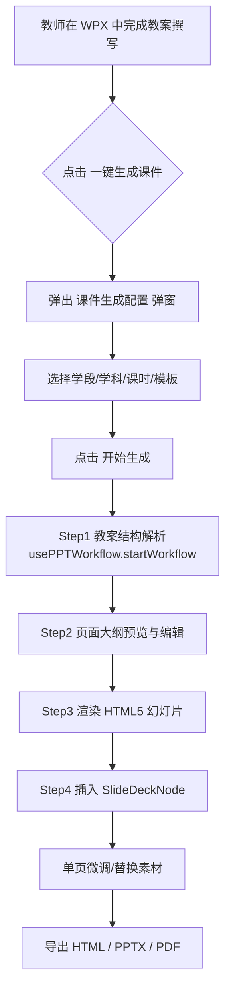
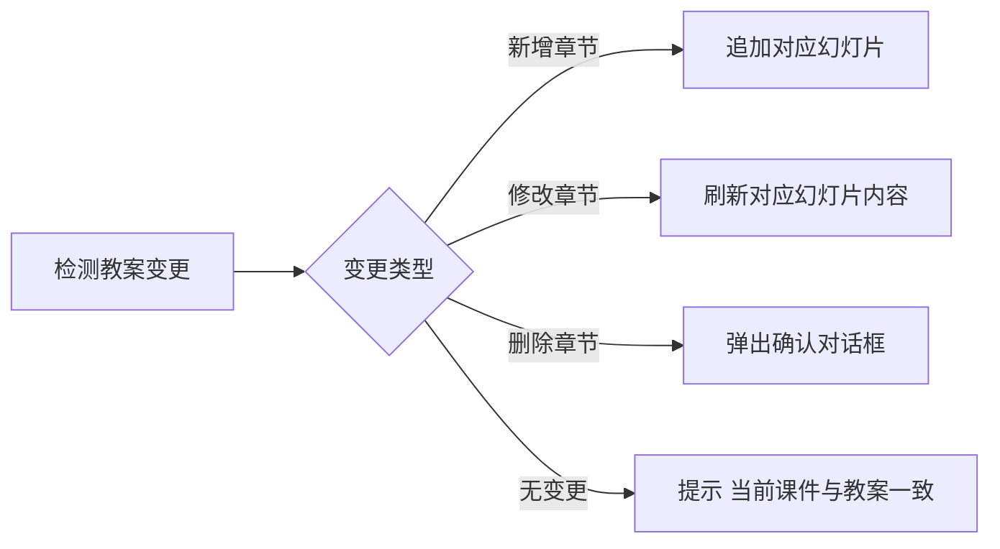
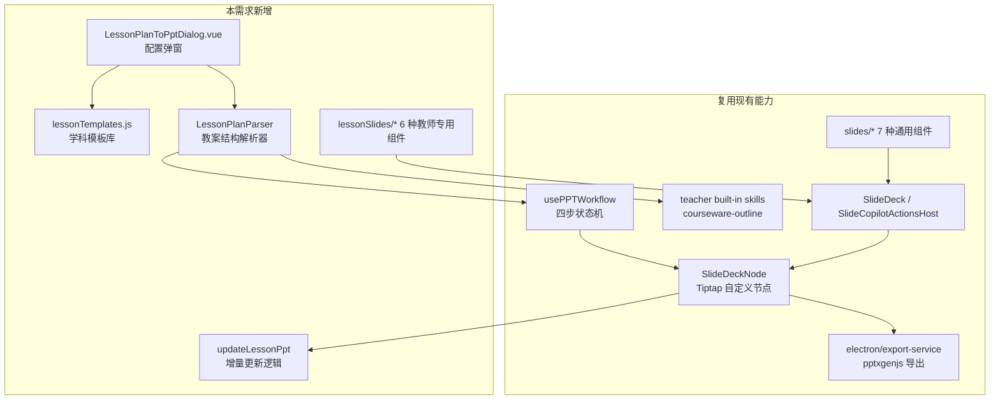

# WPX 教师教案生成课件 PPT 需求文档

**版本**：V1.0（草案）
**状态**：需求评审中
**关联文档**：[WPX-AI智能文档编辑器 PRD](./WPX-AI智能文档编辑器%20-%20产品需求文档%20(PRD).md) · [WPX AI 演示文稿生成器需求文档](./WPX%20AI%20演示文稿生成器需求文档.md) · [WPX 内置教师专用 Skills 需求文档](./WPX%20内置教师专用%20Skills%20需求文档.md) · [WPX 技术架构总览 V2.0](./WPX%20技术架构总览%20V2.0.md) · [WPX 多窗口独立编辑器架构设计](./WPX%20多窗口独立编辑器架构设计.md)
**最后更新**：2026-06-29

---

## 〇、为什么需要这份文档

现有两份相关文档的定位如下：

| 现有文档 | 定位 | 与本场景的关系 |
|:---|:---|:---|
| [WPX AI 演示文稿生成器需求文档](./WPX%20AI%20演示文稿生成器需求文档.md) | **通用 PPT 生成器**：从空白开始，通过 AI 对话四步生成 PPT | 提供底层能力（四步工作流、SlideDeckNode、PPTX/HTML 导出），但不区分场景 |
| [WPX 内置教师专用 Skills 需求文档](./WPX%20内置教师专用%20Skills%20需求文档.md) | **教师 Skills 清单**：16 款教师专用 Skills 的元数据与 Prompt | 在「教学准备类」中提供了 `courseware-outline` Skill（教案→PPT 要点大纲），但未给出端到端的「教案→课件 PPT」流程 |

教师备课的「最后一公里」是：**写完教案 → 一键生成可在课堂演示的 PPT 课件**。这条路径目前在 WPX 中：
- 没有一键入口，需要在 AI 对话里手动说"生成 PPT"，再让 AI 凭空生成（与教案内容脱节）；
- 缺少教案结构解析（教学目标 / 重难点 / 教学过程 / 板书 / 作业）；
- 缺少教师场景专用的幻灯片页面类型（导入页 / 知识点讲解页 / 例题页 / 课堂练习页 / 板书页 / 小结页 / 作业布置页）；
- 缺少学科 / 学段差异化模板（语文 / 数学 / 英语 / 物理 / 化学 / 生物 / 道德与法治 / 历史 / 地理 / 信息科技 等）。

本需求文档专门承接这一场景，**复用**通用演示文稿生成器的底层能力，**扩展**教师场景的特殊能力，并在编辑器中提供**一键入口**。

---

## 一、概述

### 1.1 一句话定义

教师完成教案撰写后，在 WPX 中点击「一键生成课件」按钮，系统自动把教案结构解析为幻灯片大纲、按学科模板渲染为 HTML5 课件、并支持导出为标准 PPTX 或可交互 HTML 网页。

### 1.2 核心价值

1. **省时**：单节课从教案到课件的时间从 60–90 分钟降至 5–10 分钟。
2. **保结构**：课件严格遵循教案结构（教学目标 / 重难点 / 教学过程 / 板书 / 作业），不会让 AI 自由发挥导致偏离教师意图。
3. **可调可控**：生成的每页幻灯片都是真实 Vue 组件（与现有 SlideDeck 节点同构），教师可单页修改后再导出。
4. **离线可用**：复用 jcode 引擎与本地指令系统，断网时仍可完成解析与生成（导出与 AI 润色除外）。

### 1.3 关键设计原则

- **不替代教师决策**：AI 只做结构化与渲染，核心内容来自教案原文，不做"凭空发挥"。
- **可追溯**：每张幻灯片右下角显示来源（"来自教案 §3.2 教学过程·新知讲授"），方便教师回查。
- **教师优先**：UI 默认按教师工作流组织（先选学段 / 学科 / 课时），而非 AI 自由生成。
- **复用现有能力**：四步工作流、SlideDeckNode、PPTX/HTML 导出、AI 对话窗、教师 Skills 全部沿用，不重建管道。

---

## 二、用户场景与痛点

### 2.1 目标用户画像

| 角色 | 占比 | 核心痛点 |
|:---|:---:|:---|
| 公立校一线教师（语数英主科 + 物化生政史地） | 70% | 备课时间紧张，每学期要做几十个课件；多数教师用 PowerPoint 从空白文档逐页搭建 |
| 培训机构讲师 | 15% | 课件需要频繁根据学员反馈调整结构 |
| 师范生 / 实习教师 | 10% | 缺乏教学经验，需要"按教案结构自动出课件"作为脚手架 |
| 其他（教研员 / 名师工作室） | 5% | 需要在教案与课件之间保持一致性，便于教研沉淀 |

### 2.2 关键用户故事

**故事 1（核心场景）**：
> 王老师刚在 WPX 中完成一份《人教版七年级数学·一元一次方程》的教案。她想：能不能直接让系统按教案生成课件？她点击工具栏的「生成课件」按钮，3 秒后看到 18 页 PPT 草稿，结构与教案完全对应。她翻到第 5 页，把"等式性质"那页的例题换成自己班常用的版本，然后导出 PPTX，第二天上课用。

**故事 2（学科差异）**：
> 李老师教物理，课件里需要画电路图。她希望生成物理课件时，系统自动按"物理想理课件模板"渲染：背景偏深蓝、电路图使用 schematic 风格、知识点页右侧留出"板书区"占位。

**故事 3（多课时）**：
> 张老师完成了一整个单元（共 5 课时）的教案。他希望一次性生成 5 份独立课件，分别对应 5 节课，而不是合并为 1 份冗长的课件。

**故事 4（修订）**：
> 赵老师上周生成的课件，学生反馈"练习太少"。她回到教案，把"课堂练习"部分扩写了一段说明。她希望再次点击「更新课件」时，系统能识别教案的差异，只刷新对应的幻灯片，而不是整份重做。

---

## 三、端到端流程

### 3.1 主流程（首次生成）



### 3.2 流程细节

**Step 0 — 入口触发**
- 编辑器顶部工具栏新增图标「生成课件」（图标：presentation / projector-screen）。
- AI 对话窗中识别关键词：「生成课件」「做课件」「出 PPT」「做个幻灯片」「转 PPT」等。
- 右键菜单：选中教案段落 →「把这段生成一页课件」。
- 快捷键：`Ctrl/Cmd + Shift + P`。

**Step 1 — 教案结构解析**
- 系统读取当前文档的 Markdown 全文。
- 调用 `courseware-outline` 内置 Skill（[详见教师 Skills 文档 §2.1](./WPX%20内置教师专用%20Skills%20需求文档.md)）识别教案结构。
- 预期教案结构（兼容主流模板）：
  ```
  # 课题：一元一次方程（第1课时）
  ## 一、教学目标
  ## 二、教学重难点
  ## 三、教学过程
  ### 3.1 复习导入
  ### 3.2 新知讲授
  ### 3.3 例题讲解
  ### 3.4 课堂练习
  ### 3.5 课堂小结
  ### 3.6 作业布置
  ## 四、板书设计
  ## 五、教学反思
  ```
- 解析失败或教案结构不规范时，进入「**智能推断模式**」：基于 H1 / H2 / H3 自动划分页面，由教师在 Step 2 手动调整。

**Step 2 — 页面大纲预览与编辑**
- 复用 [WPX AI 演示文稿生成器需求文档 §2 第一步](./WPX%20AI%20演示文稿生成器需求文档.md) 的「大纲确认」交互。
- 在大纲中显示每个章节对应的**页面类型**（系统建议）：
  - 课题 → `CoverSlide`（封面）
  - 教学目标 → `OutlineSlide`（学习目标）
  - 教学重难点 → `KeyPointsSlide`（重难点）
  - 复习导入 → `LeadInSlide`（导入）
  - 新知讲授 → `ConceptSlide`（概念讲解）
  - 例题讲解 → `ExampleSlide`（例题）
  - 课堂练习 → `PracticeSlide`（练习）
  - 课堂小结 → `SummarySlide`（小结）
  - 作业布置 → `HomeworkSlide`（作业）
  - 板书设计 → `BlackboardSlide`（板书）
  - 教学反思 → `ReflectionSlide`（反思，可选）
- 教师可：
  - 增 / 删 / 改页面；
  - 调整页面类型（如把"新知讲授"页拆成 3 页）；
  - 重新指认章节对应的页面类型；
  - 跨教案合并（多课时合并为一份课件）。

**Step 3 — 渲染 HTML5 幻灯片**
- 复用 [WPX AI 演示文稿生成器需求文档 §3.1](./WPX%20AI%20演示文稿生成器需求文档.md) 的 7 种基础组件，并新增 4 种教师专用组件（详见 §五）。
- 教师专用的样式覆盖（按学科模板）：
  - 语文：宋体优先，封面偏水墨风；
  - 数学：白底蓝调，公式页支持 LaTeX 渲染（KaTeX）；
  - 英语：白底，搭配英文字体（Source Han Serif）；
  - 物理 / 化学 / 生物：深色背景，适合电路图 / 实验图；
  - 道德与法治 / 历史 / 地理：暖色调，图文页更多；
  - 信息科技：科技感模板（深色 + 发光）。

**Step 4 — 插入编辑器**
- 通过 `editor.chain().insertSlideDeck().run()` 插入 SlideDeckNode。
- 节点默认放在教案文档末尾，与教案共存（教师可在两者之间自由切换）。

**Step 5 — 微调与导出**
- 复用 [WPX AI 演示文稿生成器需求文档 §2 第四步](./WPX%20AI%20演示文稿生成器需求文档.md) 的「自然语言修改 + 转换导出」能力。
- 新增：「**导出为 PPTX（带教案附录）**」——一份 PPTX 内含课件主体 + 末尾 1–2 页教案原文链接。

### 3.3 增量更新流程（再次生成）

教师修改教案后，工具栏的按钮变为「更新课件」。点击后：



实现机制：
- 用文档内容哈希（如 `hashDocumentContent`）记录上次生成时的教案指纹；
- 用章节级别的 `diff` 算法定位新增 / 修改 / 删除；
- 不重建整份 PPT，只更新变化部分（性能与体验更佳）。

---

## 四、输入契约：教案结构识别

### 4.1 输入要求

| 字段 | 类型 | 说明 | 必填 |
|:---|:---|:---|:---:|
| 文档类型 | `'lesson-plan'` | 固定为教案，触发教师课件流程 | 是 |
| 学科 | `'chinese' \| 'math' \| 'english' \| ...` | 用于选择学科模板 | 是 |
| 学段 | `'primary' \| 'junior' \| 'senior'` | 小学 / 初中 / 高中 | 是 |
| 课时编号 | `number` | 第几课时 | 否 |
| 教材版本 | `'人教版' \| '北师大版' \| '苏教版' \| ...` | 用于术语对齐 | 否 |
| 学情 | `string` | 学生基础描述，用于 AI 调整难度 | 否 |

### 4.2 教案结构兼容矩阵

| 主流教案模板 | 章节标识符 | 识别置信度 |
|:---|:---|:---:|
| WPX 官方模板（推荐） | 一、教学目标；二、教学重难点；三、教学过程 | 高（>95%） |
| 人教版标准模板 | 教学目标 / 教学重点 / 教学难点 / 教学过程 | 高 |
| 北师大版模板 | 教学目标 / 教学重点和难点 / 教学过程 / 板书设计 | 高 |
| 苏教版 / 沪教版 / 粤教版 | 各自标准章节 | 中（需在配置弹窗中手动确认） |
| 自由格式（非标） | 自动基于 H1/H2/H3 划分 | 低（进入智能推断模式） |

### 4.3 解析失败兜底

当解析置信度 < 60% 时：
- 弹窗提示「未识别到标准教案结构，是否启用智能推断？」
- 启用后：基于 H1 = 一页、H2 = 一页、H3 = 一项要点的规则生成大纲，由教师在 Step 2 调整。

---

## 五、输出契约：教师专用页面类型

在现有 [WPX AI 演示文稿生成器需求文档 §3.1](./WPX%20AI%20演示文稿生成器需求文档.md) 的 7 种通用组件（`CoverSlide` / `TocSlide` / `TextSlide` / `ImageTextSlide` / `ChartSlide` / `TableSlide` / `EndSlide`）基础上，新增 6 种教师专用组件：

### 5.1 OutlineSlide（学习目标页）
- 用途：呈现教学目标（知识与技能 / 过程与方法 / 情感态度价值观三维目标）。
- Props：`title`、`objectives: Array<{ dimension, items: string[] }>`。
- 样式：左侧分类标签，右侧要点列表；不同维度用不同颜色色块区分。

### 5.2 LeadInSlide（导入页）
- 用途：复习导入 / 情境导入 / 问题导入。
- Props：`title`、`scenario`、`questions: string[]`、`mediaUrl?`。
- 样式：上半部分情境描述 / 图片，下半部分引导问题（带"？"图标）。

### 5.3 ConceptSlide（概念讲解页）
- 用途：新知讲授，定义 / 性质 / 公式 / 定理。
- Props：`title`、`definition`、`keyPoints: string[]`、`formula?`、`formulaLatex?`。
- 样式：标题居中，正文分块，公式用 KaTeX 渲染并突出显示。

### 5.4 ExampleSlide（例题页）
- 用途：典型例题讲解。
- Props：`title`、`problem`、`solution: string[]`、`analysis?`、`tips?`。
- 样式：左侧题目 + 右侧解答；解答用步骤编号（1./2./3.）。

### 5.5 PracticeSlide（练习页）
- 用途：课堂练习。
- Props：`title`、`questions: Array<{ stem, type, options?, difficulty }>`、`answerVisible?: boolean`。
- 样式：题目列表，每题带难度星标（★/★★/★★★）；教师可勾选显示答案。

### 5.6 SummarySlide（小结页）
- 用途：课堂小结 / 知识网络。
- Props：`title`、`keyPoints: string[]`、`mindMap?: { nodes, edges }`。
- 样式：左侧要点列表，右侧思维导图（用 ECharts graph 渲染）。

### 5.7 BlackboardSlide（板书页）
- 用途：板书设计稿。
- Props：`title`、`layout: 'linear' | 'tree' | 'table'`、`sections: Array<{ label, content }>`。
- 样式：黑板底色（深绿 #1e3a2e）+ 白色粉笔字 + 红色重点标记；布局模拟真实板书排布。

### 5.8 HomeworkSlide（作业页）
- 用途：作业布置。
- Props：`title`、`tasks: Array<{ type: '必做'|'选做'|'实践', description, source? }>`。
- 样式：分必做 / 选做 / 实践三类，带难度标签与预计完成时间。

### 5.9 ReflectionSlide（反思页）
- 用途：教学反思（可选页）。
- Props：`title`、`highlights: string[]`、`improvements: string[]`。
- 样式：左右两栏，左「亮点」右「待改进」。

---

## 六、模板与学科差异化

### 6.1 内置学科模板清单

| 学段 | 学科 | 模板 ID | 主色 | 字体 | 特色 |
|:---|:---|:---|:---|:---|:---|
| 小学 | 语文 | `primary-chinese` | 暖米白 #faf7f0 | 宋体 | 拼音注音、田字格占位 |
| 小学 | 数学 | `primary-math` | 白底蓝调 #1976d2 | 黑体 | 算式块、田字格、尺规工具图标 |
| 小学 | 英语 | `primary-english` | 浅蓝 #e3f2fd | Comic Sans / 圆体 | 单词卡片、配图大图 |
| 初中 | 语文 | `junior-chinese` | 米色 #f5f0e1 | 宋体 | 文言文注释、文白对照 |
| 初中 | 数学 | `junior-math` | 白底 #ffffff | 黑体 | 几何图形、坐标系 |
| 初中 | 英语 | `junior-english` | 白底 #ffffff | 等线 | 语法框、对话气泡 |
| 初中 | 物理 | `junior-physics` | 深蓝 #0d1b2a | 思源黑体 | 实验图、电路图 |
| 初中 | 化学 | `junior-chemistry` | 深紫 #1a0d2e | 思源黑体 | 分子模型、反应方程式 |
| 初中 | 道德与法治 | `junior-moral` | 暖红 #c0392b | 宋体 | 案例框、引导问题 |
| 高中 | 数学 | `senior-math` | 白底 #ffffff | Cambria Math | 复杂公式、向量几何 |
| 高中 | 物理 | `senior-physics` | 深蓝 #0a1929 | 思源黑体 | 矢量图、受力分析 |
| 高中 | 化学 | `senior-chemistry` | 深紫 #1a0d2e | 思源黑体 | 有机结构式、电子云 |
| 高中 | 生物 | `senior-biology` | 深绿 #1b3a2b | 思源宋体 | 细胞图、遗传图谱 |
| 高中 | 信息技术 | `senior-it` | 黑色 #000000 | JetBrains Mono | 代码块、流程图 |
| 通用 | 自定义 | `custom` | — | — | 教师自描述 |

### 6.2 模板数据结构

每个模板以 JSON 描述：

```json
{
  "id": "junior-physics",
  "name": "初中物理·深蓝实验风",
  "subject": "physics",
  "stage": "junior",
  "preview": "/templates/junior-physics/preview.png",
  "theme": {
    "primary": "#0d1b2a",
    "secondary": "#1976d2",
    "accent": "#ff6f00",
    "background": "#fafafa",
    "textColor": "#212121",
    "fontFamily": "Source Han Sans CN",
    "fontHeading": "Source Han Sans CN Bold"
  },
  "pageDefaults": {
    "cover": { "layout": "centered", "showLogo": false },
    "concept": { "showFormula": true, "highlightColor": "#ff6f00" },
    "practice": { "showDifficulty": true, "showAnswerToggle": true }
  }
}
```

模板文件存放在 `wpx-app/src/data/lesson-templates/`。

---

## 七、入口与 UI 设计

### 7.1 编辑器工具栏入口

在编辑器顶部工具栏（`EditorToolbar.vue`）的「导出」按钮旁，新增「生成课件」按钮：

```vue
<button
  class="wpx-toolbar-btn"
  title="一键生成课件（Ctrl/Cmd+Shift+P）"
  @click="openLessonPlanToPptDialog"
>
  <PresentationIcon />
  <span>生成课件</span>
</button>
```

状态规则：
- 文档类型识别为 `lesson-plan` 时，按钮高亮（蓝底白字）。
- 文档无 H1/H2/H3 结构时，按钮置灰，hover 提示「当前文档暂无章节结构，请先撰写教案」。
- 已生成课件后，按钮变为「更新课件」。

### 7.2 课件生成配置弹窗（`LessonPlanToPptDialog.vue`）

弹窗结构：

```
┌────────────────────────────────────────┐
│ 生成课件                          [×]  │
├────────────────────────────────────────┤
│ 学科：[数学 ▼]                         │
│ 学段：[初中 ▼]                         │
│ 教材版本：[人教版 ▼]                   │
│ 课时：第 [1] 课时                       │
│ 模板：[默认] / [商务简约] / [科技感]... │
│ ┌──────────────────────────────┐       │
│ │ 模板预览缩略图（4 列）       │       │
│ └──────────────────────────────┘       │
│ 学情：[本班学生数学基础一般...]         │
│                                        │
│ □ 包含板书设计                          │
│ □ 包含教学反思                          │
│ □ 包含作业布置                          │
│                                        │
│             [取消]   [开始生成]         │
└────────────────────────────────────────┘
```

### 7.3 AI 对话窗中的关键词扩展

扩展现有 [WPX AI 演示文稿生成器需求文档 §2](./WPX%20AI%20演示文稿生成器需求文档.md) 的 PPT 意图识别正则，在 `PPT_TYPE_WORDS` 中追加：

```js
const LESSON_PPT_TRIGGER = /(?:做|写|生成|出|搞个|弄个|弄一份)?\s*(课件|教学课件|上课用|讲稿)/
```

并在匹配成功后，向 `usePPTWorkflow.startWorkflow(topic, { context: 'lesson-plan' })` 传入 context 标识，触发教师专属的四步交互（带学科 / 学段 / 模板选择前置面板）。

### 7.4 右键菜单（局部生成）

在编辑器中选中某段 Markdown，右键菜单新增「**把这段生成一页课件**」：
- 选中文本作为该页内容；
- 默认使用当前文档已配置的学科 / 模板；
- 生成的幻灯片插入到选中段落的下方。

---

## 八、数据流与组件交互

### 8.1 与现有能力的关系



### 8.2 关键模块说明

#### 8.2.1 `LessonPlanParser`（教案结构解析器）

路径：`wpx-app/src/utils/lessonPlanParser.js`

职责：
1. 接收 Markdown 全文，识别章节标题；
2. 与内置教案模板匹配，输出标准化大纲 JSON；
3. 给出每个章节的页面类型建议；
4. 给出解析置信度。

```js
/**
 * @param {string} markdown
 * @param {object} context { subject, stage, textbookVersion }
 * @returns {{
 *   outline: Array<{ id, title, type, content, sourceLineRange }>,
 *   confidence: number,
 *   warnings: string[]
 * }}
 */
export function parseLessonPlan(markdown, context) { ... }
```

#### 8.2.2 `lessonTemplates.js`（学科模板库）

路径：`wpx-app/src/data/lesson-templates/index.js`

导出所有内置学科模板（详见 §6.2 数据结构）。导出函数：

```js
export function getTemplateBySubject(subject, stage) { ... }
export function listTemplates() { ... }
```

#### 8.2.3 `usePPTWorkflow.context` 扩展

在 `usePPTWorkflow.startWorkflow(topic, options)` 的 options 中支持：

```ts
interface StartWorkflowOptions {
  context?: 'generic' | 'lesson-plan'
  lessonPlanConfig?: {
    subject: string
    stage: 'primary' | 'junior' | 'senior'
    templateId: string
    textbookVersion?: string
    includeBlackboard?: boolean
    includeReflection?: boolean
    includeHomework?: boolean
    studentContext?: string
  }
}
```

当 `context === 'lesson-plan'` 时：
- Step 1 自动调用 `LessonPlanParser`；
- Step 2 默认渲染教师专用大纲编辑器；
- Step 3 渲染时按学科模板选择组件变体。

#### 8.2.4 教师专用幻灯片组件

路径：`wpx-app/src/components/slides/lesson/`

```
lesson/
├── OutlineSlide.vue         # 学习目标
├── LeadInSlide.vue          # 导入
├── ConceptSlide.vue         # 概念讲解
├── ExampleSlide.vue         # 例题
├── PracticeSlide.vue        # 课堂练习
├── SummarySlide.vue         # 小结（含思维导图）
├── BlackboardSlide.vue      # 板书
├── HomeworkSlide.vue        # 作业
└── ReflectionSlide.vue      # 反思
```

每个组件遵循现有 [slides/* 组件规范](./WPX%20AI%20演示文稿生成器需求文档.md)：接收 `props` + `theme`，无副作用，可在 `SlideDeck` 中混用通用与专用组件。

#### 8.2.5 增量更新（`updateLessonPpt`）

在 editor store 中新增：

```js
// stores/editor.js
const lessonPptDiff = ref(null) // 最近一次 diff 结果

async function updateLessonPpt() {
  const currentHash = await hashDocumentContent(getMarkdown())
  if (currentHash === lastGeneratedHash.value) {
    toast.info('当前课件与教案一致，无需更新')
    return
  }
  const diff = diffOutline(lastOutline.value, parseLessonPlan(...).outline)
  lessonPptDiff.value = diff
  // 用户在弹窗中确认更新策略后，仅刷新变化页面
}
```

### 8.3 IPC / 导出复用

- **HTML 导出**：复用 `slides:export-html` 通道，无需新增 IPC。
- **PPTX 导出**：复用 `slides:export-pptx` / `slides:export-pptx-buffer` 通道。
- **PDF 导出**：复用 `slides:export-pdf`（如不存在则新增，与通用 PPT 导出共用）。
- **"带教案附录"导出**：在 PPTX 末尾追加 1–2 页"本课件来自教案 §..." 的引用页，由前端组装 slides 数组后调用现有 IPC。

### 8.4 与教师 Skills 的协同

| 触发点 | 触发 Skill | 协同方式 |
|:---|:---|:---|
| Step 1 教案结构解析 | `courseware-outline` | 调用其 Prompt 模板，把教案提炼为结构化要点 |
| Step 2 大纲微调 | `knowledge-breakdown` | 在新知讲授页自动调用，把知识点拆为递进式问题链 |
| Step 3 幻灯片渲染 | （可选）`lesson-plan-generator` | 把生成的草稿对照原始教案，校验一致性 |
| Step 4 课后 | `teaching-reflection` | 课后再次点击「生成课件」可一键产出教学反思页（可选） |

---

## 九、与多窗口架构的协同

参考 [WPX 多窗口独立编辑器架构设计](./WPX%20多窗口独立编辑器架构设计.md)，教师常见工作模式：

| 工作流 | 窗口布局 |
|:---|:---|
| 单窗口：写教案 + 生成课件 | 一个窗口，编辑器中 |
| 双窗口：左右对照 | 左窗口编辑教案，右窗口预览课件 |
| 多窗口：批量生成 | 打开 N 个教案窗口，依次生成课件，AI 资源池共享 |

新增 IPC 通道（如需）：

| 通道名 | 方向 | 用途 |
|:---|:---|:---|
| `lesson:open-ppt-dialog` | 主→渲染 | 通知任意窗口打开「生成课件」弹窗 |
| `lesson:share-template` | 渲染→主 | 跨窗口共享教师选择的模板 |

> 上述 IPC 仅在多窗口场景需要时新增；单窗口默认不占用。

---

## 十、离线与本地化

### 10.1 离线能力

| 能力 | 离线可用 | 说明 |
|:---|:---:|:---|
| 教案结构解析（基于正则 + 关键词） | ✅ | 不依赖 AI 模型 |
| 大纲编辑 | ✅ | 纯前端 |
| 幻灯片渲染（基础版） | ✅ | 不调用 AI |
| AI 润色 / 自然语言修改 | ❌ | 需联网或本地 jcode 引擎 |
| 导出 HTML | ✅ | 纯前端 |
| 导出 PPTX | ✅ | 复用现有 pptxgenjs |
| 导出 PDF | ⚠️ | 依赖系统 PDF 能力 |

### 10.2 本地指令触发

在 [WPX AI 本地指令系统需求文档](./WPX%20AI%20本地指令系统需求文档.md) 中注册本地指令：

| 指令 | 说明 |
|:---|:---|
| `/lesson-to-ppt` | 一键生成课件（等价于点击工具栏按钮） |
| `/lesson-update-ppt` | 增量更新课件 |
| `/lesson-template-set <id>` | 切换当前文档的默认模板 |

---

## 十一、权限、模式与免费策略

参考 PRD §〇，本需求适配 **WPX 完全免费模式（V1.1）**：

1. 所有内置学科模板、教案解析、教师专用组件均**永久免费**。
2. AI 润色、跨窗口同步等联网能力依赖用户自配大模型 API Key（与现有 PPT 生成器一致）。
3. 不涉及字体付费（板书 / 标题字体使用 WPX 内置免费字体）。
4. 不引入 Token 计费或配额限制。

---

## 十二、性能要求

| 指标 | 目标值 | 备注 |
|:---|:---:|:---|
| 教案结构解析 | < 1s | 万字以内教案 |
| 单页幻灯片渲染 | < 200ms | 不含 AI 润色 |
| 整份课件生成（20 页） | < 5s | 纯前端，不含 AI |
| 增量更新 diff 计算 | < 500ms | 章节级 diff |
| PPTX 导出（20 页） | < 3s | 复用现有 pptxgenjs 路径 |
| HTML 导出（20 页） | < 1s | 纯前端 |

---

## 十三、验收标准

### 13.1 功能验收

1. ✅ 编辑器工具栏出现「生成课件」按钮，快捷键 `Ctrl/Cmd+Shift+P` 可触发。
2. ✅ 在标准教案模板（教学目标 / 教学过程 / 板书 / 作业）下，点击后 3 秒内弹出 Step 1 大纲预览。
3. ✅ 大纲中每个章节自动标注页面类型建议，教师可调整。
4. ✅ Step 2 选择的学科模板在 Step 3 的渲染中真实生效（颜色 / 字体 / 布局差异可见）。
5. ✅ 生成的幻灯片作为 SlideDeckNode 插入到教案文档末尾。
6. ✅ 至少 6 种教师专用页面类型可正常渲染（`OutlineSlide` / `ConceptSlide` / `ExampleSlide` / `PracticeSlide` / `SummarySlide` / `BlackboardSlide`）。
7. ✅ 支持导出为标准 PPTX 文件，PPTX 中图表使用 pptxgenjs 原生图表。
8. ✅ 支持导出为可交互 HTML 网页，包含翻页 / 导航 / 思维导图交互。
9. ✅ 修改教案后，点击「更新课件」仅刷新变化页面（diff 正确）。
10. ✅ 断网状态下，纯前端流程（解析 → 大纲 → 渲染 → HTML 导出）可正常完成。

### 13.2 体验验收

1. ✅ 从打开教案到生成可用课件的首次操作不超过 5 次点击。
2. ✅ 弹窗中的学科 / 学段选项自动从文档元数据推断，教师可不选直接确认默认值。
3. ✅ 生成的 PPT 至少 80% 内容与教案原文一致（不出现 AI 自由发挥导致与教案脱节）。
4. ✅ 板书页在视觉上明显区别于其他页面（深绿底色 + 粉笔字）。
5. ✅ 数学 / 物理公式页使用 KaTeX 渲染，公式可正确显示。

### 13.3 兼容验收

1. ✅ 与现有 [WPX AI 演示文稿生成器需求文档](./WPX%20AI%20演示文稿生成器需求文档.md) 的 7 种通用幻灯片组件混用正常。
2. ✅ 在 [WPX 多窗口独立编辑器架构设计](./WPX%20多窗口独立编辑器架构设计.md) 的双窗口 / 多窗口场景下可用。
3. ✅ 在 [WPX 内置教师专用 Skills 需求文档](./WPX%20内置教师专用%20Skills%20需求文档.md) 的 16 款 Skills 管理界面下，「生成课件」入口在教师专用 Skills 列表中可作为快捷入口出现。
4. ✅ V1.1 完全免费模式下不引入任何付费 / Token 机制。

---

## 十四、风险与决策记录

| 风险 | 影响 | 缓解策略 |
|:---|:---|:---|
| 教案结构识别准确率不足 | 大纲生成偏差大 | 智能推断模式兜底 + 教师手动调整 |
| 学科模板覆盖不全 | 高中 / 职教 / 幼教场景缺失 | V1.0 聚焦 K12，V2.0 扩展；支持 `custom` 自定义模板 |
| 教师 PPT 排版习惯差异大 | 模板可能不符合教师审美 | 提供"自定义"模板 + 自然语言修改能力 |
| AI 润色时偏离教案 | 生成内容与教案脱节 | 加提示词："严格基于以下教案原文，禁止添加原文中没有的事实" |
| 增量更新 diff 误判 | 修改教案后误删/误增幻灯片 | 教师在弹窗中逐项确认，diff 结果可撤销 |
| 板书页在投影上对比度不足 | 课堂演示效果差 | 深绿底色 + 白字 + 红色重点的对比度测试（WCAG AA） |

---

## 十五、版本演进

| 版本 | 范围 |
|:---|:---|
| **V1.0（本版本）** | K12 主科（语数英物化生政史地）通用模板；6 种教师专用组件；标准四步流程；HTML/PPTX 导出；增量更新 |
| V1.1 | 公式页 KaTeX 深度优化；板书页手写动画；课堂计时器组件 |
| V1.2 | 学情自适应（AI 根据学情调整例题难度）；多课时批量生成 |
| V2.0 | 职教 / 幼教模板；与希沃 / 鸿合等教学平台对接；课堂实录 AI 转写生成反思页 |

---

## 十六、相关文件清单

> 本需求落地时预计新增 / 修改的文件清单：

**新增：**
- `wpx-app/src/components/export/LessonPlanToPptDialog.vue` — 配置弹窗
- `wpx-app/src/utils/lessonPlanParser.js` — 教案结构解析器
- `wpx-app/src/data/lesson-templates/index.js` — 学科模板库入口
- `wpx-app/src/data/lesson-templates/*.json` — 各学科模板配置
- `wpx-app/src/components/slides/lesson/` — 6+ 种教师专用组件
- `wpx-app/src/stores/lessonPpt.js` — 课件生成状态 store
- `wpx-app/src/__tests__/lesson-to-ppt-e2e.spec.js` — 端到端测试

**修改：**
- `wpx-app/src/composables/usePPTWorkflow.js` — 支持 `context: 'lesson-plan'`
- `wpx-app/src/components/editor/EditorToolbar.vue` — 新增「生成课件」按钮
- `wpx-app/src/components/editor/EditorCore.vue` — 新增右键菜单与快捷键
- `wpx-app/src/components/ai/AiChatWindow.vue` — 扩展 PPT 意图识别
- `wpx-app/src/stores/editor.js` — 新增 `lessonPptDiff` 与 `updateLessonPpt` 方法
- `wpx-app/src/data/built-in-skills.js` — 注册本地指令 `/lesson-to-ppt`

---

**文档结束。**