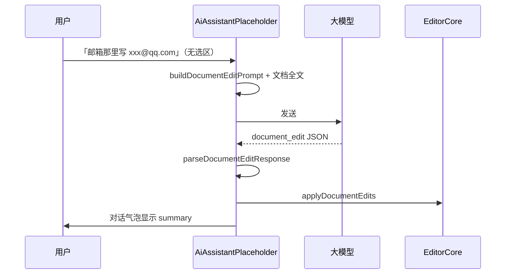
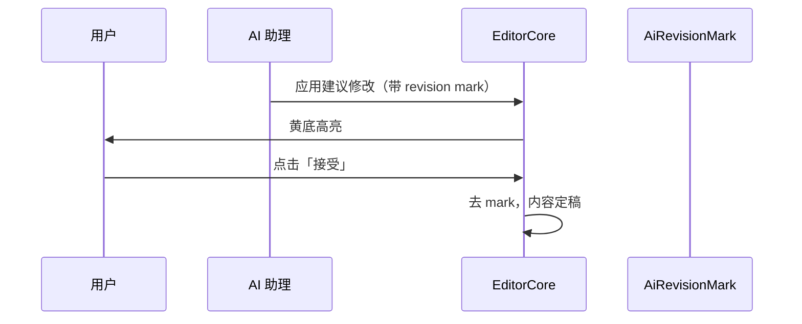

# WPX 画布内 AI 修订需求文档

**版本**：V0.1（需求 + 技术方案）· **轻量过渡已实现（V0.1-MVP）**  
**状态**：轻量过渡已落地 · 完整修订审批待迭代  
**关联文档**：[AI助手-V1-需求文档](./AI助手-V1-需求文档.md) · [WPX AI 本地指令系统需求文档](./WPX%20AI%20本地指令系统需求文档.md) · [PRD](./WPX-AI智能文档编辑器%20-%20产品需求文档%20(PRD).md)  
**最后更新**：2026-08-27

---

## 1. 背景与问题

当前 AI 助手（V1）以**对话窗**为核心：

| 场景 | 现有行为 |
|------|----------|
| 用户**选中**文本后下指令 | AI 返回后直接替换选区 |
| 用户**未选中**，如「邮箱那里写 xxx@qq.com」 | AI 仅在对话窗回复，需点「使用该文档」或手动粘贴 |

这与产品期望的 **「AI 在画布内定位修改 → 黄色高亮待审 → 用户接受/拒绝」**（类 Office 修订）不一致。

**根因**：

1. 无选区时不附带文档全文，模型无法定位「邮箱那里」
2. 输出为自然语言，前端无法结构化应用
3. TipTap 尚无「待审修订 Mark + 审批 UI」

---

## 2. 产品目标

### 2.1 终态（V1.0 画布修订）

用户用自然语言描述修改意图（无需先选中），AI：

1. 读取当前文档结构与文本
2. 在画布中**定位**目标位置并生成**建议修改**
3. 以**黄色背景**（及可选删除线）标记待审内容
4. 用户在画布或侧栏 **接受 / 拒绝** 每一处或批量处理
5. 接受后变为正式内容；拒绝后恢复原样
6. 导出时可选择是否包含修订标记

### 2.2 轻量过渡（V0.1-MVP · 已实现）

在完整修订 UI 完成前，先解决「无选区也能改文档」：

| 能力 | V0.1-MVP | 完整版 |
|------|----------|--------|
| 附带文档上下文 | ✅ | ✅ |
| 结构化 edit JSON | ✅ | ✅ |
| 自动查找 anchor 并写入 | ✅ | ✅ |
| 黄色高亮待审 | ❌ | ✅ |
| 接受/拒绝 | ❌（直接写入） | ✅ |
| 多处并发修订 | 部分（顺序应用） | ✅ |

对话窗展示一行 **summary**（如「已在「邮箱」处填入 xxx@qq.com」），不再要求用户点「使用该文档」。

---

## 3. 用户场景

### 场景 A：表单字段填写（P0 · 轻量过渡已覆盖）

1. 文档含「姓名」「邮箱」等标签行  
2. 用户：「邮箱那里写 1055603323@qq.com」  
3. AI 定位「邮箱」标签，写入邮箱值  
4. 对话窗提示已修改；画布即时更新  

### 场景 B：局部措辞替换（P1）

1. 用户：「把第三段的『非常』改成『极其』」  
2. AI 返回 `replace_match` 编辑操作  
3. 完整版：黄底高亮；MVP：直接替换  

### 场景 C：纯问答（不回写）

1. 用户：「这段是什么意思？」  
2. AI 返回 `{ "type": "chat", "message": "..." }`  
3. 仅对话展示，不改文档  

### 场景 D：修订审批（P0 · 完整版）

1. AI 应用建议修改并黄底标记  
2. 用户点击「接受」或「拒绝」  
3. 接受：去标记、保留内容；拒绝：撤销修改  

---

## 4. 功能需求

### 4.1 文档上下文注入

| 编号 | 需求 | 验收 |
|------|------|------|
| D-01 | 无选区发送时附带当前文档 Markdown | prompt 含 `【当前文档全文】` |
| D-02 | 超长文档截断 | 默认最多 8000 字符，保留尾部并注明截断 |
| D-03 | 空文档 | 仍走 document_edit prompt，模型可返回 chat |

### 4.2 结构化编辑协议

AI 必须返回 JSON（可包在 ` ```json ` 代码块内）：

```json
{
  "type": "document_edit",
  "edits": [
    {
      "anchor": "邮箱",
      "text": "1055603323@qq.com",
      "strategy": "fill_label"
    }
  ],
  "summary": "已在「邮箱」处填入 1055603323@qq.com"
}
```

**strategy 枚举（V0.1）**：

| strategy | 说明 |
|----------|------|
| `fill_label` | 定位标签（如「邮箱」「邮箱：」），替换该行标签后的值为 `text` |
| `replace_match` | 将文档中首次匹配的 `anchor` 文本替换为 `text` |
| `insert_after` | 在 `anchor` 之后插入 `text` |

纯问答：

```json
{ "type": "chat", "message": "..." }
```

### 4.3 画布应用（V0.1-MVP）

| 编号 | 需求 | 验收 |
|------|------|------|
| A-01 | 解析 JSON 后顺序应用 edits | 调用 TipTap `insertContentAt` |
| A-02 | 应用成功 | 对话窗显示 `summary`，不显示原始 JSON |
| A-03 | 定位失败 | 对话窗提示「未能定位：{anchor}」 |
| A-04 | 有选区时 | 仍走原有选区替换流程，不走 document_edit |

### 4.4 修订 Mark + 审批 UI（完整版 · 待实现）

| 编号 | 需求 | 优先级 |
|------|------|--------|
| R-01 | TipTap `AiRevisionMark`：黄色背景 `bg-yellow-200/60` | P0 |
| R-02 | 删除类修订：红色删除线 + 黄底新文本 | P1 |
| R-03 | 浮动条：接受 / 拒绝 / 全部接受 | P0 |
| R-04 | 修订列表侧栏（可选） | P2 |
| R-05 | 导出时剥离 revision mark | P0 |
| R-06 | 用户手动编辑时 revision 位置漂移处理 | P1 |

---

## 5. 交互流程

### 5.1 轻量过渡（已实现）



### 5.2 完整修订（规划）



---

## 6. 技术方案

### 6.1 模块划分

```
wpx-app/src/utils/aiDocumentEdit.js     ← prompt / parse / apply（V0.1 已实现）
wpx-app/src/extensions/AiRevisionMark.js ← 完整版 TipTap Mark（待实现）
wpx-app/src/components/editor/AiRevisionBar.vue ← 接受/拒绝条（待实现）
wpx-app/src/components/layout/AiAssistantPlaceholder.vue ← 发送与响应同步（已接入 V0.1）
```

### 6.2 与现有架构的关系

| 现有模块 | 关系 |
|----------|------|
| `useLocalCommands` | 本地确定性指令仍**优先**；未命中才走 document_edit |
| `editorStore.requestReplace` | 选区改写继续使用；document_edit 直接操作 editor |
| `buildSelectionPrompt` | 有选区时不变 |
| `editorFindReplace.findNextMatch` | document_edit 定位复用 |

### 6.3 AiRevisionMark 设计草案（完整版）

```javascript
// extensions/AiRevisionMark.js
export const AiRevisionMark = Mark.create({
  name: 'aiRevision',
  addAttributes() {
    return {
      revisionId: { default: null },
      kind: { default: 'insert' }, // insert | delete | replace
    }
  },
  renderHTML() {
    return ['mark', { class: 'ai-revision-mark', 'data-revision-id': ... }, 0]
  },
})
```

CSS：

```css
.ai-revision-mark {
  background-color: rgb(254 240 138 / 0.7); /* yellow-200 */
  border-radius: 2px;
}
```

**acceptRevision(id)**：`unsetMark` + 更新 store  
**rejectRevision(id)**：按 revision 元数据还原 doc 片段  

### 6.4 状态管理（完整版）

建议在 `editorStore` 或独立 `revisionStore` 维护：

```typescript
interface PendingRevision {
  id: string
  from: number
  to: number
  originalText: string
  suggestedText: string
  status: 'pending' | 'accepted' | 'rejected'
}
```

### 6.5 Token 与性能

- 8000 字符文档 ≈ 4000–6000 tokens（视模型分词）
- 后续可做：仅发送选段 + 结构摘要、RAG 式段落检索
- 表单类短文档可全量发送

### 6.6 测试策略

| 层级 | 覆盖 |
|------|------|
| 单元 | `parseDocumentEditResponse`、`resolveEditRange`、`applyDocumentEdits` |
| 组件 | `syncLatestAssistantMessage` 在 document_edit 下展示 summary |
| E2E | 无选区发送「邮箱写 xxx」→ 画布更新 + 对话 summary |

---

## 7. 迭代路线

| 阶段 | 内容 | 预估 |
|------|------|------|
| **V0.1-MVP** ✅ | 文档上下文 + JSON edit + 直接写入 + summary | 已完成 |
| **V0.2** | `AiRevisionMark` + 单处接受/拒绝 | 3–5 天 |
| **V0.3** | 多处修订、revision 列表、导出净化 | 1–2 周 |
| **V1.0** | Office 级体验：删除线、批量审批、位置漂移 | 2–4 周 |

---

## 8. 风险与对策

| 风险 | 对策 |
|------|------|
| 模型定位错误 | summary 明确说明；完整版可拒绝；后续加固 prompt + 本地 anchor 校验 |
| 长文档超 token | 截断 + 后续段落检索 |
| 同一 anchor 多处匹配 | V0.1 取首次匹配；完整版让模型返回更精确 anchor 或行号 |
| 与选区改写冲突 | 有选区时禁用 document_edit 路径 |

---

## 9. V0.1-MVP 实现清单

- [x] `aiDocumentEdit.js`：prompt / parse / apply
- [x] `AiAssistantPlaceholder`：无选区走 document_edit prompt
- [x] 响应同步：解析 JSON 并应用，展示 summary
- [x] 单元测试 `aiDocumentEdit.spec.js`
- [x] P0 修复：`assistantSyncTracker` 防止 onChatFinish + isLoading 双重 apply
- [x] P1 修复：`looksLikeDocumentEditIntent` 意图门控（仅编辑类指令附带全文）
- [x] E2E `ai-document-edit.spec.js`
- [ ] `AiRevisionMark` 扩展
- [ ] 接受/拒绝 UI
- [ ] E2E spec

---

## 10. 附录：Prompt 片段（V0.1）

无选区时用户消息经 `buildDocumentEditPrompt` 包装，要求模型**仅**输出 JSON。  
System prompt 仍使用 `buildEditorAiSystemPrompt`；document_edit 规则在用户消息中显式声明，避免与选区改写规则冲突。
